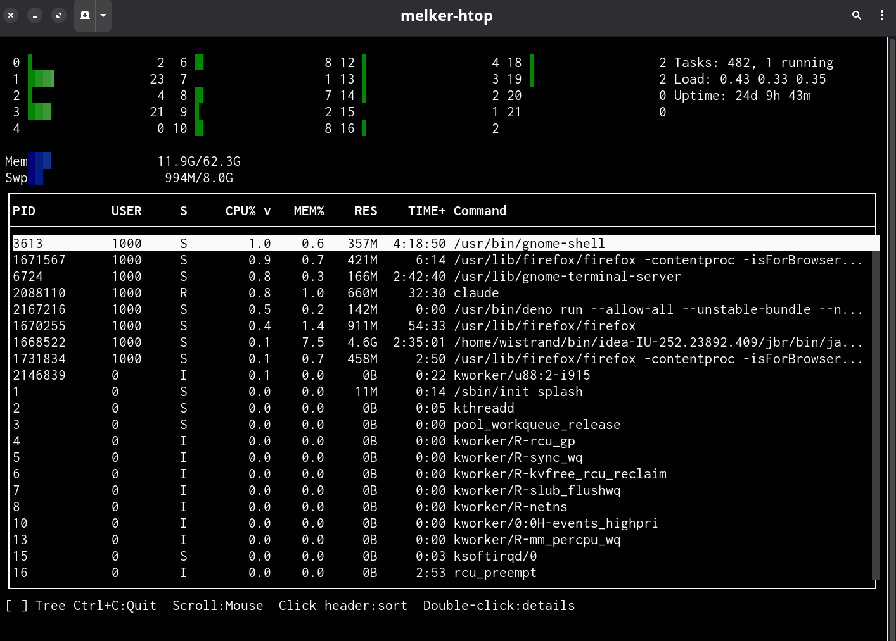

# Melker

*Run text with meaning*

**Website:** [melker.sh](https://melker.sh)

A TUI framework for apps you want to share safely.

Melker apps are documents you can read before you run them. Share via URL, declare permissions in a policy, inspect with Dev Tools.

**[Read the Manifesto](MANIFESTO.md)** for the philosophy behind this approach.

**[Read the FAQ](FAQ.md)** for common questions.

---

## Why Melker?

| Feature                      | Melker | Other TUI Frameworks |
|------------------------------|:------:|:--------------------:|
| Run from URL                 |   Y    |          -           |
| Permission sandbox           |   Y    |          -           |
| App approval system          |   Y    |          -           |
| Inspect policy before run    |   Y    |          -           |
| Dev Tools (source, policy, inspect) |   Y    |          -           |
| Literate UI (Markdown)       |   Y    |          -           |
| No build step                |   Y    |         Some         |

*See [full comparison](agent_docs/tui-comparison.md) with Ink, Textual, Bubble Tea, Ratatui, and others.*

---

## Installation

Melker is distributed via git. No package managers, no registries, no version conflicts. Clone it, symlink it, done.

### Requirements

- **Deno 2.5+** (Node.js and Bun not supported)
- ANSI-compatible terminal
- **Nerd Fonts** (recommended for graphics) - Melker uses sextant characters for canvas/image rendering. On macOS, install a [Nerd Font](https://www.nerdfonts.com/) and configure your terminal to use it. For terminals without Unicode support, use `--gfx-mode=block` (colored spaces), `--gfx-mode=pattern` (ASCII spatial), or `--gfx-mode=luma` (ASCII brightness).

### Option 1: Clone and Run

```bash
git clone https://github.com/wistrand/melker.git
cd melker
./melker.ts examples/basics/hello.melker
```

### Option 2: Global Install via Symlink

```bash
# Clone to a permanent location
git clone https://github.com/wistrand/melker.git ~/melker

# Create symlink (ensure ~/.local/bin is in your PATH)
ln -s ~/melker/melker.ts ~/.local/bin/melker

# Run from anywhere
melker app.melker
```

The CLI is symlink-safe - it resolves its real path before importing dependencies.

### Releases

Melker uses CalVer (`YYYY.MM.PATCH`). List available releases:

```bash
git tag --list 'v*' | sort -V
```

Checkout a specific release:

```bash
git checkout v2026.01.1
```

### Not Just Trust - Real UI

Melker apps look and feel like apps:

- Flexbox layout, not just text dumps
- CSS-like styling, 16M colors, theme auto-detection
- Mouse and keyboard throughout
- Tables with sorting and selection
- Dialogs, menus, prompts

#### Showcase

A system monitor: [View source](examples/showcase/htop.melker)



---

## Quick Start

Create `hello.melker`:

```html
<melker>
  <policy>
  {
    "name": "Hello App",
    "permissions": {
      "env": ["TERM"]
    }
  }
  </policy>

  <container style="border: thin; padding: 1;">
    <text style="font-weight: bold; color: cyan;">Hello, Terminal!</text>
    <button label="Exit" onClick="$melker.exit()" />
  </container>
</melker>
```

Run it:

```bash
# Direct execution (melker.ts has executable shebang)
./melker.ts hello.melker

# Or via deno run
deno run --allow-all melker.ts hello.melker
```

> **Why `--allow-all`?** The launcher (`melker.ts`) needs full permissions to parse, bundle, and spawn your app. But your app runs in a **subprocess** with only the permissions declared in its `<policy>`. The launcher is trusted; the app is sandboxed.
>
> Minimal launcher permissions: `--allow-read --allow-write=/tmp --allow-env --allow-run`

Before running, you can see:
- The policy declares only `env: TERM` permission
- The UI has one text element and one exit button
- The handler calls `$melker.exit()`, nothing else

Press **F12** to open Dev Tools to view source, policy, document tree, and system info.

For tutorials, see [`agent_docs/getting-started.md`](agent_docs/getting-started.md) and the [step-by-step tutorial](https://melker.sh/tutorial.html).

---

## Key Concepts

### 1. Document-First

Apps are documents, not opaque processes. A `.melker` file is readable markup with:
- Declared permissions (`<policy>`)
- Visible structure (HTML-like elements)
- Inspectable handlers (`onClick="..."`)

### 2. Explicit Policy

Permissions are document metadata, visible before execution:

```html
<policy>
{
  "permissions": {
    "read": ["./data"],
    "write": ["./output"],
    "net": ["api.example.com"]
  }
}
</policy>
```

Run `--show-policy` to inspect without running:
```bash
./melker.ts --show-policy app.melker
```

### 3. Run from URL

Share apps via URL:

```bash
# Run directly from URL
./melker.ts https://example.com/app.melker

# Remote apps require explicit policy (enforced)
# First run prompts for approval (hash-based)
```

### 4. Three Abstraction Levels

**Programmatic** - TypeScript API:
```typescript
const btn = createElement('button', { label: 'Click', onClick: () => count++ });
```

**Declarative** - `.melker` files:
```html
<button label="Click" onClick="count++" />
```

**Literate** - `.melker.md` Markdown with embedded UI:
```markdown
# My App

Documentation and UI in the same file:

<button label="Click" onClick="count++" />
```

### 5. Dev Tools

Press F12 to open Dev Tools:
- View source
- Inspect policy
- Inspect document tree (live element hierarchy with values)
- See system info

---

## Features

### Components

**Core** - no external dependencies:

| Category    | Components                                        |
|-------------|---------------------------------------------------|
| Layout      | container, flexbox, tabs                          |
| Text        | text, markdown                                    |
| Input       | input, textarea, checkbox, radio, slider          |
| Navigation  | button, command-palette                           |
| Data        | table, data-table, list                           |
| Dropdowns   | combobox, select, autocomplete, command-palette   |
| Dialogs     | dialog, alert, confirm, prompt                    |
| Feedback    | progress                                          |
| Files       | file-browser                                      |

**Advanced** - for specific needs:

| Component     | Purpose                  | Requires              |
|---------------|--------------------------|-----------------------|
| canvas        | Pixel graphics, shaders  | -                     |
| img           | Image display            | -                     |
| video         | Media playback           | FFmpeg                |
| oauth         | Auth flows               | net permission        |

### Layout

Flexbox with full support:
```html
<container style="display: flex; flex-direction: row; gap: 2;">
  <text style="flex: 1;">Left</text>
  <text style="flex: 1;">Right</text>
</container>
```

### Styling

CSS-like inline styles:
```html
<container style="border: rounded; padding: 1; color: cyan; background-color: #222;">
```

Or `<style>` tags with selectors:
```html
<style>
  button { background-color: blue; color: white; }
  #title { font-weight: bold; }
  .highlight { color: yellow; }
</style>
```

### Themes

Auto-detects terminal capabilities by default. Manual override via CLI flag or env var:
```bash
./melker.ts --theme fullcolor-dark app.melker
# or
MELKER_THEME=fullcolor-dark ./melker.ts app.melker
```

Available: `auto`, `bw-std`, `bw-dark`, `gray-std`, `gray-dark`, `color-std`, `color-dark`, `fullcolor-std`, `fullcolor-dark`

---

## Advanced Features

### Canvas and Graphics

Pixel graphics using sextant characters (2x3 pixels per cell):

```html
<canvas id="c" width="60" height="30" onPaint="draw(event.canvas)" />
```

```typescript
function draw(canvas) {
  canvas.setPixel(x, y, 0xFF0000FF);  // RGBA packed
  canvas.line(0, 0, 59, 29, color);
  canvas.rect(10, 10, 20, 15, color);
}
```

Features: true color, auto-dither, retained mode with `onPaint` callback.

### Video Playback

```html
<video src="./video.mp4" width="80" height="24" autoplay="true" />
```

Uses FFmpeg for decoding, dithering for display.

### Tables with Sorting and Selection

```html
<table style="width: fill; height: 10;">
  <thead>
    <tr><th>Name</th><th>Role</th></tr>
  </thead>
  <tbody scrollable="true" selectable="single">
    <tr data-id="1"><td>Alice</td><td>Admin</td></tr>
    <tr data-id="2"><td>Bob</td><td>User</td></tr>
  </tbody>
</table>
```

Click headers to sort. Arrow keys to navigate. Full keyboard and mouse support.

### OAuth Built-in

```html
<oauth
  wellknown="https://auth.example.com/.well-known/openid-configuration"
  clientId="my-app"
  scopes="openid profile"
  onToken="handleToken(event.token)"
/>
```

Handles browser redirect, token exchange, and secure storage.

### State Persistence

```bash
MELKER_PERSIST=true deno run --allow-all melker.ts app.melker
```

Element state persists across runs using XDG state directory.

---

## Running Apps

```bash
# Direct execution (melker.ts has executable shebang)
./melker.ts app.melker

# Or via deno run
deno run --allow-all melker.ts app.melker

# Run from URL
./melker.ts https://example.com/app.melker

# Show policy without running
./melker.ts --show-policy app.melker

# Trust mode (for CI/scripts - bypasses approval prompt that would hang)
./melker.ts --trust app.melker

# Watch mode (auto-reload on changes)
./melker.ts --watch app.melker

# Enable debug server
MELKER_DEBUG_PORT=8080 ./melker.ts app.melker
```

### Deno Flags

These Deno flags are forwarded to the app subprocess:

```bash
./melker.ts --reload https://example.com/app.melker  # Reload remote modules
./melker.ts --no-lock app.melker                      # Disable lockfile
./melker.ts --no-check app.melker                     # Skip type checking
./melker.ts --quiet app.melker                        # Suppress diagnostic output
./melker.ts --cached-only app.melker                  # Offline mode
```

**Running melker.ts from a remote URL:** Deno flags may need to appear twice - before `melker.ts` (affects loading the launcher) and after (forwarded to the app):

```bash
deno run --allow-all --reload --no-lock https://melker.sh/melker.ts --reload app.melker
```

**Note:** `https://melker.sh/melker.ts` serves the latest commit from `main` on GitHub. For reproducible builds, pin to a specific version:

```bash
# Pin to CalVer release
deno run --allow-all https://melker.sh/melker-v2026.01.1.ts app.melker

# Pin to specific commit
deno run --allow-all https://melker.sh/melker-abc123f.ts app.melker
```

Non-existent versions show a clean error: `Version not found: v2026.01.99`

---

## TypeScript API

For programmatic use, import from `mod.ts`:

```typescript
import { createElement, createApp } from './mod.ts';

const ui = createElement('container', {
  style: { border: 'thin', padding: 2 }
},
  createElement('text', { text: 'Hello!' }),
  createElement('button', { label: 'OK', onClick: () => app.exit() })
);

const app = await createApp(ui);
```

Or with template literals:

```typescript
import { melker, createApp } from './mod.ts';

const ui = melker`
  <container style=${{ border: 'thin', padding: 2 }}>
    <text>Hello!</text>
    <button label="OK" onClick=${() => app.exit()} />
  </container>
`;

const app = await createApp(ui);
```

**Note:** `melker.ts` is the CLI entry point only. All library exports are in `mod.ts`.

---

## Development

```bash
deno task check     # Type check
deno task test      # Run tests
```

### Configuration

Configuration can be set via CLI flags (highest priority), environment variables, or config file (`~/.config/melker/config.json`). Priority order: `default < policy < file < env < cli`

```bash
# View current config with sources
./melker.ts --print-config
```

| Option | CLI Flag | Env Variable | Purpose |
|--------|----------|--------------|---------|
| Theme | `--theme` | `MELKER_THEME` | Theme selection (default: `auto`) |
| Graphics mode | `--gfx-mode` | `MELKER_GFX_MODE` | `sextant` (default), `block`, `pattern`, `luma` |
| Debug port | `--debug-port` | `MELKER_DEBUG_PORT` | Enable debug server |
| Headless | `--headless` | `MELKER_HEADLESS` | Headless mode for testing |
| Alt screen | `--no-alt-screen` | `MELKER_NO_ALTERNATE_SCREEN` | Disable alternate screen buffer |
| Persist | `--persist` | `MELKER_PERSIST` | Enable state persistence |
| Log file | `--log-file` | `MELKER_LOG_FILE` | Log file path |
| Log level | `--log-level` | `MELKER_LOG_LEVEL` | `DEBUG`, `INFO`, `WARN`, `ERROR` |

### Project Structure

```
melker.ts              # CLI entry point (symlink-safe)
mod.ts                 # Library entry point (exports)
melker-launcher.ts     # Policy enforcement, subprocess spawning
src/
  melker-runner.ts     # .melker file runner
  engine.ts            # Application engine
  layout.ts            # Flexbox layout
  rendering.ts         # Render pipeline
  template.ts          # .melker file parsing
  policy/              # Permission system
  bundler/             # Runtime bundler
  components/          # UI components
  video/               # Video processing
  ai/                  # AI accessibility
examples/
  melker/              # .melker file examples
  ts/                  # TypeScript examples
docs/
  netlify/             # Netlify Edge Functions
    edge-functions/
      melker.ts        # Versioned launcher (/melker.ts, /melker-v2026.01.1.ts, /melker-abc123f.ts)
```

---

## Examples

```bash
# Counter with state
./melker.ts examples/basics/counter.melker

# Markdown viewer (pass file as argument)
./melker.ts examples/showcase/markdown-viewer.melker README.md

# Dialog system
./melker.ts examples/basics/dialog-demo.melker

# Canvas animation
./melker.ts examples/canvas/analog-clock.melker
```

---

## License

[MIT License](LICENSE.txt)

