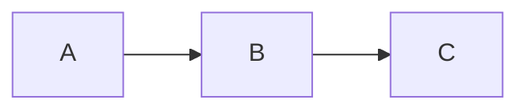
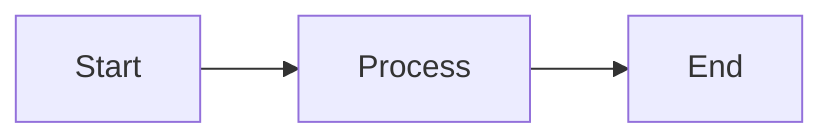
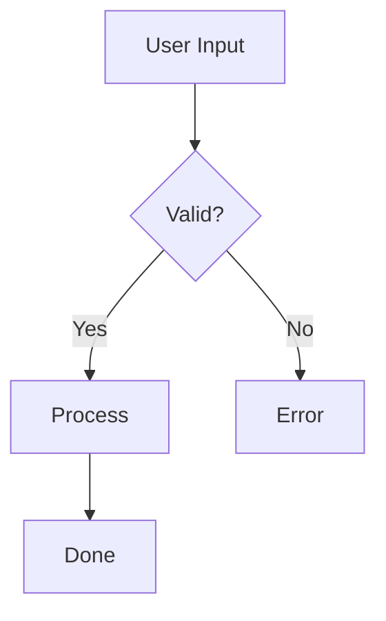
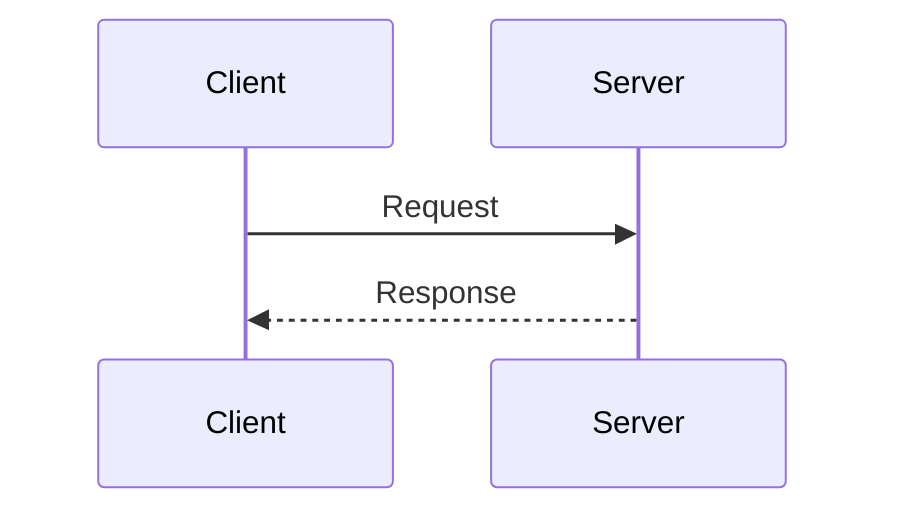
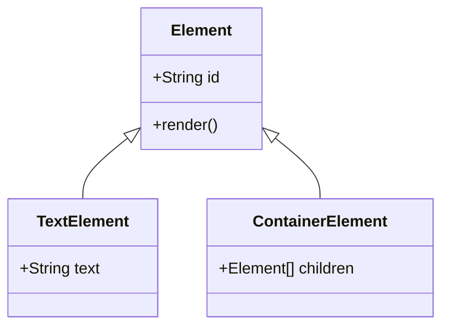

# Mermaid Diagram Support

## Summary

- Run `.mmd` files directly (`melker diagram.mmd`), embed in markdown fenced blocks, or use `<graph type="mermaid">`
- Diagrams render as interactive native elements with Unicode box-drawing — focusable, clickable nodes
- No external dependencies; parsed and laid out entirely within Melker

## Overview

Melker supports [Mermaid](https://mermaid.js.org/) diagrams in three ways:
1. **Direct .mmd files** - Run mermaid files directly with `melker diagram.mmd`
2. **In markdown** - Fenced code blocks with `mermaid` language identifier
3. **Direct component** - `<graph type="mermaid">` element in .melker files

Diagrams are rendered as interactive elements with Unicode box drawing, supporting focus, keyboard navigation, and mouse interaction.

---

## Running .mmd Files Directly

Melker can run `.mmd` (Mermaid) files directly without wrapping them in a `.melker` file:

```bash
melker diagram.mmd           # Run a mermaid file
melker --watch diagram.mmd   # Watch mode with auto-reload
melker --stdout diagram.mmd  # Output single frame to stdout
```

Plain `.mmd` files (without `%%melker` directives) require no permissions and run without approval prompts.

### Adding Custom Configuration

Use `%%melker` comments to add policy or configuration:



---

## Usage in Markdown

Embed mermaid diagrams in markdown using fenced code blocks:

~~~markdown

~~~

---

## Usage in .melker Files

Use the `<graph>` component directly in .melker files:

```xml
<graph type="mermaid">
flowchart LR
    A[Start] --> B[Process]
    B --> C[End]
</graph>
```

### Graph Component Props

| Prop    | Type                    | Default     | Description                              |
|---------|-------------------------|-------------|------------------------------------------|
| `type`  | `'mermaid'` \| `'json'` | auto-detect | Parser type                              |
| `src`   | string                  | -           | Load content from URL                    |
| `text`  | string                  | -           | Inline content (alternative to children) |
| `style` | Style                   | -           | Use `overflow: scroll` for scrolling     |

### Examples

**Inline content:**
```xml
<graph type="mermaid">
sequenceDiagram
    Client->>Server: Request
    Server-->>Client: Response
</graph>
```

**Using text prop:**
```xml
<graph type="mermaid" text="flowchart LR; A-->B" />
```

**From external file:**
```xml
<graph type="mermaid" src="./diagram.mmd" />
```

**With styling:**
```xml
<graph type="mermaid" style="border: none; padding: 2">
classDiagram
    class Animal
    class Dog
    Animal <|-- Dog
</graph>
```

---

## Supported Diagram Types

| Type              | Description                        |
|-------------------|------------------------------------|
| `flowchart`       | Flow diagrams with nodes and edges |
| `sequenceDiagram` | Sequence/interaction diagrams      |
| `classDiagram`    | Class/entity relationship diagrams |

### Flowchart Example



### Sequence Diagram Example



### Class Diagram Example



**Supported class diagram syntax:**
- Direction: `direction TB|BT|LR|RL`
- Class definitions: `class ClassName`, `class ClassName { members }`
- Member visibility: `+` public, `-` private, `#` protected, `~` package
- Methods: `name()`, `name(params)`, `name(): returnType`
- Classifiers: `*` abstract, `$` static
- Annotations: `<<interface>>`, `<<abstract>>`, `<<service>>`, `<<enumeration>>`
- Types: `String`, `int`, `List~String~` (generics), `Element[]` (arrays)
- Relationships: `<|--` inheritance, `*--` composition, `o--` aggregation, `-->` association, `..>` dependency, `..|>` realization

---

## Architecture

### Subtree Rendering

Mermaid diagrams are rendered as **subtree elements** - they are:

1. **Owned by markdown** - Cached in `_mermaidElements` map
2. **Rendered inline** - Via `renderElementSubtree()` helper
3. **Not document children** - Avoids double rendering
4. **Discoverable** - Via `getSubtreeElements()` interface

### Key Components

| Component                   | File                             | Purpose                            |
|-----------------------------|----------------------------------|------------------------------------|
| `MarkdownElement`           | `src/components/markdown.ts`     | Parses and caches mermaid blocks   |
| `GraphElement`              | `src/components/graph/graph.ts`  | Renders mermaid as Melker elements |
| `renderElementSubtree()`    | `src/rendering.ts`               | Renders nested element trees       |
| `_hitTestSubtreeElements()` | `src/hit-test.ts`                | Hit testing for subtree elements   |

### Element Discovery

Components can expose subtree elements by implementing:

```typescript
getSubtreeElements(): Element[]
```

This interface is used by:
- **Document** - `getElementById()` searches subtrees
- **FocusManager** - Tab navigation includes subtree elements
- **HitTester** - Click detection for subtree elements
- **DevTools** - Inspect tab shows subtree elements
- **AI Assistant** - Context includes subtree elements

---

## Interaction Support

### Focus

Interactive elements within mermaid diagrams (inputs, buttons) are focusable:
- Click to focus
- Tab navigation includes mermaid elements
- Focused inputs show cursor

### Bounds Registration

Subtree element bounds are registered via `registerElementBounds()` in the render context, enabling:
- Accurate hit testing
- Focus management
- Cursor positioning

---

## Limitations

1. **No animation** - Static rendering only
2. **Text-based** - Uses Unicode box drawing, not graphics
3. **Size estimation** - Complex diagrams may need manual height hints
4. **Subset support** - Not all Mermaid features are supported

---

## Files

| File                                                | Purpose                                |
|-----------------------------------------------------|----------------------------------------|
| `src/components/markdown.ts`                        | Mermaid block detection and caching    |
| `src/components/graph/graph.ts`                     | Graph element and mermaid parser       |
| `src/components/graph/parsers/mermaid-flowchart.ts` | Mermaid flowchart parser               |
| `src/components/graph/parsers/mermaid-sequence.ts`  | Mermaid sequence diagram parser        |
| `src/components/graph/parsers/mermaid-class.ts`     | Mermaid class diagram parser           |
| `src/components/graph/graph-to-melker.ts`           | Converts graph data to Melker elements |
| `src/rendering.ts`                                  | `renderElementSubtree()` helper        |
| `src/hit-test.ts`                                   | Subtree hit testing                    |
| `src/focus.ts`                                      | Subtree focus management               |
| `src/document.ts`                                   | Subtree element search                 |

---

## See Also

- [graph-architecture.md](graph-architecture.md) — Graph component internals, parsers, and layout engine
- [component-reference.md](component-reference.md) — Full `<graph>` component documentation with JSON input examples
