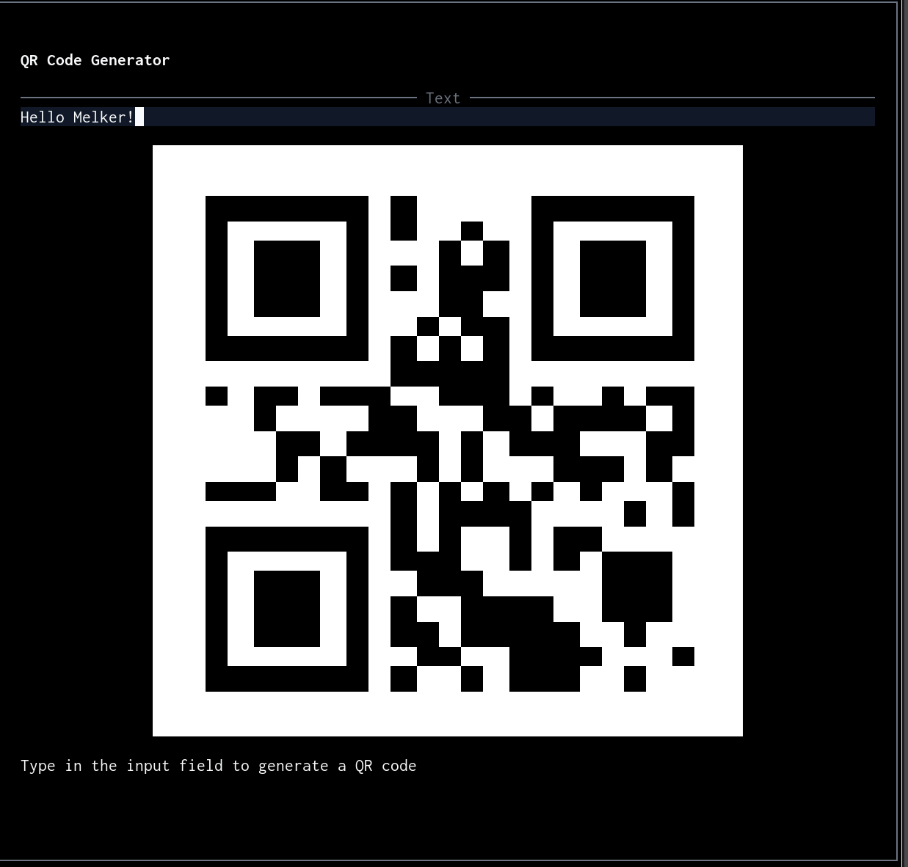

# Writing Your First Melker App

This tutorial walks you through building a QR Code Generator app, introducing Melker concepts step by step.



**What you'll learn:**
- Basic file structure
- Layout with containers and flexbox
- Text and styling
- Input handling and events
- Scripts and the `$melker` API
- Dynamic image display
- Policies and permissions

## Step 1: Basic Structure

Every Melker app starts with a `<melker>` root element:

```xml
<melker>
  <title>QR Code Generator</title>

  <container>
    <text>Hello, Melker!</text>
  </container>
</melker>
```

Save this as `qr-code.melker` and run it:

```bash
./melker.ts qr-code.melker
```

**Concepts introduced:**
- `<melker>` - Root element (required)
- `<title>` - Sets the terminal window title
- `<container>` - Layout container (like a `<div>`)
- `<text>` - Display text content

## Step 2: Layout with Flexbox

Melker uses flexbox for layout. Let's create a structured UI:

```xml
<melker>
  <title>QR Code Generator</title>

  <container style="width: 100%; height: 100%; padding: 2; display: flex; flex-direction: column; gap: 1; border: thin">
    <text style="font-weight: bold;">QR Code Generator</text>

    <container style="flex-direction: row; gap: 1; align-items: center;">
      <text>Text:</text>
      <text>[ input will go here ]</text>
    </container>

    <container style="flex: 1; display: flex; justify-content: center; align-items: center;">
      <text>[ QR code will go here ]</text>
    </container>

    <text>Type in the input field to generate a QR code</text>
  </container>
</melker>
```

**Concepts introduced:**
- `style` attribute with CSS-like properties
- `width: 100%; height: 100%` - Fill available space
- `flex-direction: column` - Stack children vertically
- `flex-direction: row` - Arrange children horizontally
- `flex: 1` - Expand to fill remaining space
- `gap: 1` - Space between children (in terminal rows/columns)
- `border: thin` - Add a border
- `padding: 2` - Inner spacing
- `font-weight: bold` - Bold text

## Step 3: Adding an Input Field

Replace the placeholder with an actual input:

```xml
<container style="flex-direction: row; gap: 1; align-items: center;">
  <text>Text:</text>
  <input
    id="text-input"
    placeholder="Enter text to encode..."
    style="flex: 1;"
  />
</container>
```

**Concepts introduced:**
- `<input>` - Single-line text input
- `id` - Unique identifier for accessing elements from scripts
- `placeholder` - Hint text shown when empty
- `style="flex: 1"` - Input expands to fill available width

## Step 4: Handling Events

Add an event handler to respond to input changes:

```xml
<input
  id="text-input"
  placeholder="Enter text to encode..."
  style="flex: 1;"
  onChange="$melker.alert('You typed: ' + event.value)"
/>
```

Type something and press Enter - you'll see an alert dialog!

**Concepts introduced:**
- `onChange` - Event handler (fires when input value changes)
- `event.value` - The current input value
- `$melker.alert()` - Show a modal alert dialog

## Step 5: Adding a Script

For more complex logic, use a `<script>` block. Scripts use TypeScript:

```xml
<melker>
  <title>QR Code Generator</title>

  <script type="typescript">
    let currentText = 'Hello Melker!';

    export function updateText(text: string) {
      currentText = text;
      $melker.alert('Current text: ' + currentText);
    }
  </script>

  <container style="width: 100%; height: 100%; padding: 2; display: flex; flex-direction: column; gap: 1; border: thin">
    <text style="font-weight: bold;">QR Code Generator</text>

    <container style="flex-direction: row; gap: 1; align-items: center;">
      <text>Text:</text>
      <input
        id="text-input"
        placeholder="Enter text to encode..."
        style="flex: 1;"
        onChange="$app.updateText(event.value)"
      />
    </container>

    <text>Type in the input field</text>
  </container>
</melker>
```

**Concepts introduced:**
- `<script type="typescript">` - TypeScript code block
- `export function` - Functions must be exported to be callable from event handlers
- `$app.functionName()` - Call exported functions from event handlers
- Script variables persist across function calls

## Step 6: Accessing Elements from Scripts

Use `$melker.getElementById()` to access and manipulate elements:

```xml
<script type="typescript">
  let currentText = 'Hello Melker!';

  export function updateText(text: string) {
    if (!text) text = ' ';
    currentText = text;

    // Update a text element to show the current value
    const display = $melker.getElementById('display');
    if (display) {
      display.setValue('Current: ' + currentText);
    }
  }
</script>

<!-- In your UI -->
<text id="display">Current: Hello Melker!</text>
```

**Concepts introduced:**
- `$melker.getElementById(id)` - Get an element by its ID
- `element.setValue(value)` - Set the element's display value
- Null checking with `if (element)` - Element may not exist

## Step 7: Async Initialization

For setup that needs to run after the UI is ready, use an async script:

```xml
<script type="typescript">
  let currentText = 'Hello Melker!';

  export async function init() {
    // Set initial input value
    const input = $melker.getElementById('text-input');
    if (input) {
      input.setValue(currentText);
    }
    $melker.render();
  }

  export function updateText(text: string) {
    currentText = text;
  }
</script>

<script type="typescript" async="ready">
  await $app.init();
</script>
```

**Concepts introduced:**
- `async="ready"` - Script runs after first render (UI is ready)
- `$melker.render()` - Manually trigger a re-render
- Separating initialization from function definitions

## Step 8: Displaying Images

Add an `` element and load images dynamically:

```xml
<container style="flex: 1; display: flex; justify-content: center; align-items: center;">
  
</container>
```

Load images from scripts using `setSrc()`:

```typescript
export async function updateQR(text: string) {
  const img = $melker.getElementById('qr-img');
  await img?.setSrc('path/to/image.png');
  // Or use a data URL:
  // await img?.setSrc('data:image/gif;base64,...');
}
```

**Concepts introduced:**
- `` - Image display component
- `width="fill"`, `height="fill"` - Fill available space
- `objectFit="contain"` - Maintain aspect ratio
- `element.setSrc(url)` - Load an image (async, last call wins)

## Step 9: Using npm Packages

Melker runs on Deno and can import npm packages directly:

```typescript
import encodeQR from 'npm:qr';

export async function updateQR(text: string) {
  const gifBytes = encodeQR(text, 'gif');
  const base64 = btoa(String.fromCharCode(...gifBytes));
  const dataUrl = `data:image/gif;base64,${base64}`;

  const img = $melker.getElementById('qr-img');
  await img?.setSrc(dataUrl);
}
```

**Concepts introduced:**
- `import ... from 'npm:package'` - Import npm packages
- Generating data URLs for dynamic images

## Step 10: Adding Permissions with Policy

When your app needs network access (like downloading npm packages), declare permissions:

```xml
<melker>
  <title>QR Code Generator</title>

  <policy>
  {
    "name": "QR Code Generator",
    "description": "Generate QR codes from text input",
    "permissions": {
      "net": ["registry.npmjs.org", "cdn.jsdelivr.net"]
    }
  }
  </policy>

  <!-- rest of app -->
</melker>
```

**Concepts introduced:**
- `<policy>` - JSON permission declaration
- `permissions.net` - Network access to specific hosts
- Users approve permissions on first run

## Complete App

Here's the final QR Code Generator:

```xml
<melker>
  <title>QR Code Generator</title>

  <policy>
  {
    "name": "QR Code Generator",
    "description": "Generate QR codes from text input",
    "permissions": {
      "net": ["registry.npmjs.org", "cdn.jsdelivr.net"]
    }
  }
  </policy>

  <script type="typescript">
    import encodeQR from 'npm:qr';

    let currentText = 'Hello Melker!';

    export async function updateQR(text: string) {
      if (!text) {
        text = ' '; // QR needs at least something
      }
      currentText = text;

      try {
        const gifBytes = encodeQR(text, 'gif');
        const base64 = btoa(String.fromCharCode(...gifBytes));
        const dataUrl = `data:image/gif;base64,${base64}`;

        const img = $melker.getElementById('qr-img');
        await img?.setSrc(dataUrl);
      } catch (err) {
        $melker.logger?.error('QR generation failed', err);
      }
    }

    export async function init() {
      const input = $melker.getElementById('text-input');
      if (input) {
        input.setValue(currentText);
      }
      await updateQR(currentText);
      $melker.render();
    }
  </script>

  <script type="typescript" async="ready">
    await $app.init();
  </script>

  <container style="width: 100%; height: 100%; padding: 2; display: flex; flex-direction: column; gap: 1; border: thin">
    <text style="font-weight: bold;">QR Code Generator</text>

    <container style="flex-direction: row; gap: 1; align-items: center;">
      <text>Text:</text>
      <input
        id="text-input"
        placeholder="Enter text to encode..."
        style="flex: 1;"
        onChange="$app.updateQR(event.value)"
      />
    </container>

    <container style="flex: 1; display: flex; justify-content: center; align-items: center;">
      
    </container>

    <text>Type in the input field to generate a QR code</text>
  </container>
</melker>
```

## Key Takeaways

| Concept | Example |
|---------|---------|
| Root element | `<melker>...</melker>` |
| Window title | `<title>My App</title>` |
| Layout | `<container style="flex-direction: column">` |
| Styling | `style="border: thin; padding: 1; gap: 1"` |
| Text input | `<input id="myInput" onChange="..." />` |
| Event handlers | `onChange="$app.myFunction(event.value)"` |
| Scripts | `<script type="typescript">export function ...` |
| Async init | `<script async="ready">await $app.init()</script>` |
| Get elements | `$melker.getElementById('id')` |
| Set values | `element.setValue('text')` |
| Load images | `await img.setSrc('url')` |
| Manual render | `$melker.render()` |
| Logging | `$melker.logger?.error('message', err)` |
| Permissions | `<policy>{"permissions": {"net": [...]}}</policy>` |
| npm packages | `import pkg from 'npm:package'` |

## Next Steps

- Explore more components: `<button>`, `<checkbox>`, `<select>`, `<dialog>`, `<tabs>`
- See [COMPONENTS.md](../skills/creating-melker-apps/references/COMPONENTS.md) for the full component reference
- Check out [examples/melker/](../examples/melker/) for more example apps
- Press F12 at runtime to open DevTools (inspect elements, view logs)
