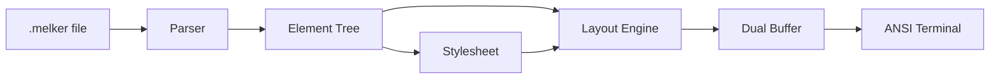

# Architecture

Melker's rendering pipeline:

```mermaid
flowchart LR
    A[".melker file"] --> B["Parser"]
    B --> C["Element Tree"]
    C --> D["Layout Engine"]
    D --> E["Dual Buffer"]
    E --> F["ANSI Terminal"]
    C --> G["Stylesheet"]
    G --> D
```

Each render cycle resolves styles, computes flexbox layout, and diff-renders to the terminal.
