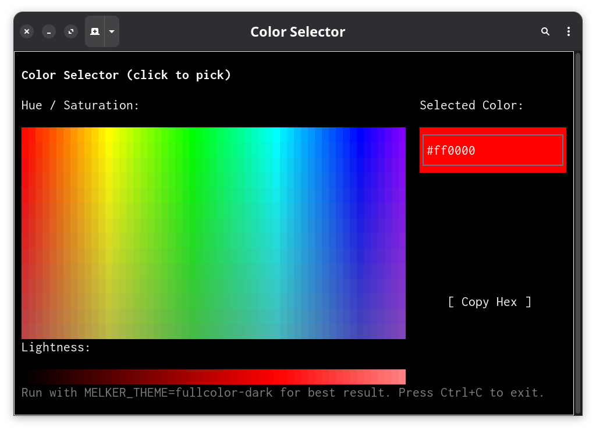

# Color Selector

An HSL color picker with interactive canvas for selecting hue, saturation, and lightness.

Run with: `MELKER_THEME=fullcolor-dark deno run --allow-all melker.ts examples/melker-md/color_selector.md`



## Layout

```melker-block
+--root Color Selector-----------------------------------------+
| : c 1                                                        |
| +--header--+                                                 |
|                                                              |
| +--main--------------------------------------------------+   |
| | : r 2                                                  |   |
| | +--palette-container--+ +--info-panel----------------+ |   |
| +--------------------------------------------------------+   |
|                                                              |
| +--footer--+                                                 |
+--------------------------------------------------------------+
```

## Components

### Header

```melker-block
+--header-------------------------------------+
| type: text                                  |
| text: Color Selector (click to pick)        |
+---------------------------------------------+
```

### Palette Container

```melker-block
+--palette-container--------------------------+
| : c 1                                       |
| +--hue-sat-label--+                         |
| +--hue-sat-canvas-+                         |
| +--lightness-label--+                       |
| +--lightness-canvas-+                       |
+---------------------------------------------+
```

### Hue/Sat Label

```melker-block
+--hue-sat-label------------------------------+
| type: text                                  |
| text: Hue / Saturation:                     |
+---------------------------------------------+
```

### Hue/Sat Canvas

```melker-block
+--hue-sat-canvas-----------------------------+
| type: canvas                                |
+---------------------------------------------+
```

### Lightness Label

```melker-block
+--lightness-label----------------------------+
| type: text                                  |
| text: Lightness:                            |
+---------------------------------------------+
```

### Lightness Canvas

```melker-block
+--lightness-canvas---------------------------+
| type: canvas                                |
+---------------------------------------------+
```

### Info Panel

```melker-block
+--info-panel---------------------------------+
| : c 1                                       |
| +--preview-label--+                         |
| +--preview--------+                         |
| +--color-values---+                         |
| +--copy-btn-------+                         |
+---------------------------------------------+
```

### Preview Label

```melker-block
+--preview-label------------------------------+
| type: text                                  |
| text: Selected Color:                       |
+---------------------------------------------+
```

### Preview

```melker-block
+--preview------------------------------------+
| : = -                                       |
| +--preview-text--+                          |
+---------------------------------------------+
```

### Preview Text

```melker-block
+--preview-text-------------------------------+
| type: text                                  |
| text: #ff0000                               |
+---------------------------------------------+
```

### Color Values

```melker-block
+--color-values-------------------------------+
| : c                                         |
| +--hex-label--+                             |
| +--hex-value--+                             |
| +--rgb-label--+                             |
| +--rgb-value--+                             |
| +--hsl-label--+                             |
| +--hsl-value--+                             |
+---------------------------------------------+
```

### Value Labels and Text

```melker-block
+--hex-label--+
| type: text  |
| text: Hex:  |
+-------------+
```

```melker-block
+--hex-value------+
| type: text      |
| text: #ff0000   |
+-----------------+
```

```melker-block
+--rgb-label--+
| type: text  |
| text: RGB:  |
+-------------+
```

```melker-block
+--rgb-value-----------+
| type: text           |
| text: rgb(255, 0, 0) |
+----------------------+
```

```melker-block
+--hsl-label--+
| type: text  |
| text: HSL:  |
+-------------+
```

```melker-block
+--hsl-value----------------+
| type: text                |
| text: hsl(0, 100%, 50%)   |
+---------------------------+
```

### Copy Button

```melker-block
+--copy-btn-----------------------------------+
| type: button                                |
| title: Copy Hex                             |
+---------------------------------------------+
```

### Footer

```melker-block
+--footer-------------------------------------------------+
| type: text                                              |
| text: Run with MELKER_THEME=fullcolor-dark for          |
|       best result. Press Ctrl+C to exit.                |
+---------------------------------------------------------+
```

## Styles

```css
/* @melker style */
#root {
  padding: 1;
}
#header {
  font-weight: bold;
}
#info-panel {
  width: 28;
}
#preview {
  height: 3;
  border: thin;
}
.label, #hue-sat-label, #lightness-label, #preview-label,
#hex-label, #rgb-label, #hsl-label {
  color: gray;
}
#footer {
  color: gray;
}
```

## Canvas Properties

```json
{
  "@target": "#hue-sat-canvas",
  "width": 72,
  "height": 24,
  "dither": "auto",
  "onPaint": "paintHueSatPalette(event)",
  "onClick": "handlePaletteClick(event)"
}
```

```json
{
  "@target": "#lightness-canvas",
  "width": 72,
  "height": 2,
  "dither": "auto",
  "onPaint": "paintLightnessPalette(event)",
  "onClick": "handleLightnessClick(event)"
}
```

```json
{
  "@target": "#preview",
  "style": "background-color: #ff0000"
}
```

```json
{
  "@target": "#preview-text",
  "style": "color: white"
}
```

## Event Handlers

```typescript
// @melker handler #copy-btn.onClick
const hex = context.getElementById('hex-value');
if (hex) {
  context.copyToClipboard(hex.props.text);
  alert('Copied: ' + hex.props.text);
}
```

## Script

```typescript
// @melker script

let selectedHue = 0;
let selectedSat = 100;
let selectedLight = 50;

// Convert HSL to RGB
function hslToRgb(h: number, s: number, l: number): [number, number, number] {
  s /= 100;
  l /= 100;
  const k = (n: number) => (n + h / 30) % 12;
  const a = s * Math.min(l, 1 - l);
  const f = (n: number) => l - a * Math.max(-1, Math.min(k(n) - 3, Math.min(9 - k(n), 1)));
  return [Math.round(f(0) * 255), Math.round(f(8) * 255), Math.round(f(4) * 255)];
}

// Convert RGB to hex string
function rgbToHex(r: number, g: number, b: number): string {
  return '#' + [r, g, b].map(c => c.toString(16).padStart(2, '0')).join('');
}

function updateColorDisplay() {
  const [r, g, b] = hslToRgb(selectedHue, selectedSat, selectedLight);
  const hex = rgbToHex(r, g, b);

  const preview = context.getElementById('preview');
  const hexValue = context.getElementById('hex-value');
  const rgbValue = context.getElementById('rgb-value');
  const hslValue = context.getElementById('hsl-value');

  if (preview) {
    preview.props.style.backgroundColor = hex;
    const luminance = (0.299 * r + 0.587 * g + 0.114 * b) / 255;
    const textColor = luminance > 0.5 ? 'black' : 'white';
    const previewText = context.getElementById('preview-text');
    if (previewText) {
      previewText.props.text = hex;
      previewText.props.style.color = textColor;
    }
  }
  if (hexValue) hexValue.props.text = hex;
  if (rgbValue) rgbValue.props.text = `rgb(${r}, ${g}, ${b})`;
  if (hslValue) hslValue.props.text = `hsl(${selectedHue}, ${selectedSat}%, ${selectedLight}%)`;
}

function paintHueSatPalette(event: any) {
  const { canvas } = event;
  if (!canvas) return;

  const size = canvas.getBufferSize();
  const width = size.width;
  const height = size.height;

  // Draw hue-saturation gradient at current lightness
  for (let y = 0; y < height; y++) {
    const sat = 100 - (y / height) * 100;
    for (let x = 0; x < width; x++) {
      const hue = (x / width) * 360;
      const [r, g, b] = hslToRgb(hue, sat, selectedLight);
      canvas.setPixelColor(x, y, rgbToHex(r, g, b), true);
    }
  }

  // Draw crosshair at selected position
  const crossX = Math.floor((selectedHue / 360) * width);
  const crossY = Math.floor((1 - selectedSat / 100) * height);

  const [bgR, bgG, bgB] = hslToRgb(selectedHue, selectedSat, selectedLight);
  const lum = (0.299 * bgR + 0.587 * bgG + 0.114 * bgB) / 255;
  const cc = lum > 0.5 ? '#000000' : '#ffffff';

  // Horizontal line
  for (let i = -4; i <= 4; i++) {
    const px = crossX + i;
    if (px >= 0 && px < width) canvas.setPixelColor(px, crossY, cc, true);
  }
  // Vertical line
  for (let i = -4; i <= 4; i++) {
    const py = crossY + i;
    if (py >= 0 && py < height) canvas.setPixelColor(crossX, py, cc, true);
  }
}

function paintLightnessPalette(event: any) {
  const { canvas } = event;
  if (!canvas) return;

  const size = canvas.getBufferSize();
  const width = size.width;
  const height = size.height;

  // Draw lightness gradient horizontally (dark left, light right)
  for (let x = 0; x < width; x++) {
    const light = (x / width) * 100;
    const [r, g, b] = hslToRgb(selectedHue, selectedSat, light);
    const color = rgbToHex(r, g, b);
    for (let y = 0; y < height; y++) {
      canvas.setPixelColor(x, y, color, true);
    }
  }

  // Draw vertical marker at selected lightness
  const markerX = Math.floor((selectedLight / 100) * width);
  const cc = selectedLight > 50 ? '#000000' : '#ffffff';
  for (let y = 0; y < height; y++) {
    canvas.setPixelColor(markerX, y, cc, true);
  }
}

function handlePaletteClick(event: any) {
  const canvas = context.getElementById('hue-sat-canvas');
  if (!canvas) return;

  const bounds = canvas.getBounds();
  if (!bounds) return;

  const relX = event.position.x - bounds.x;
  const relY = event.position.y - bounds.y;

  selectedHue = Math.round((relX / bounds.width) * 360);
  selectedSat = Math.round((1 - relY / bounds.height) * 100);

  selectedHue = Math.max(0, Math.min(359, selectedHue));
  selectedSat = Math.max(0, Math.min(100, selectedSat));

  updateColorDisplay();
}

function handleLightnessClick(event: any) {
  const canvas = context.getElementById('lightness-canvas');
  if (!canvas) return;

  const bounds = canvas.getBounds();
  if (!bounds) return;

  const relX = event.position.x - bounds.x;
  selectedLight = Math.round((relX / bounds.width) * 100);
  selectedLight = Math.max(0, Math.min(100, selectedLight));

  updateColorDisplay();
}

exports = {
  paintHueSatPalette,
  paintLightnessPalette,
  handlePaletteClick,
  handleLightnessClick,
  updateColorDisplay
};
```
