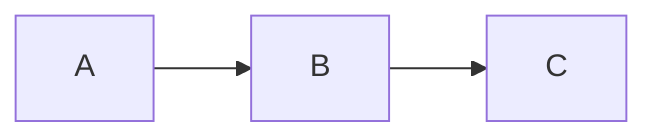

# Interactive Workflow Demo

This document demonstrates mermaid diagrams with custom melker components embedded in markdown.

## User Registration Flow

The following diagram shows a user registration workflow with interactive form elements:

## Data Processing Pipeline

Here's a simple data flow:

## Notes

- Custom components are defined using `%%melker:ID` blocks
- Each node can contain any valid melker element
- Components render as ASCII representations: `[ Button ]`, `[input]`, `[ ] checkbox`
- For full interactive components with click handlers, use `<graph>` directly in a .melker file
